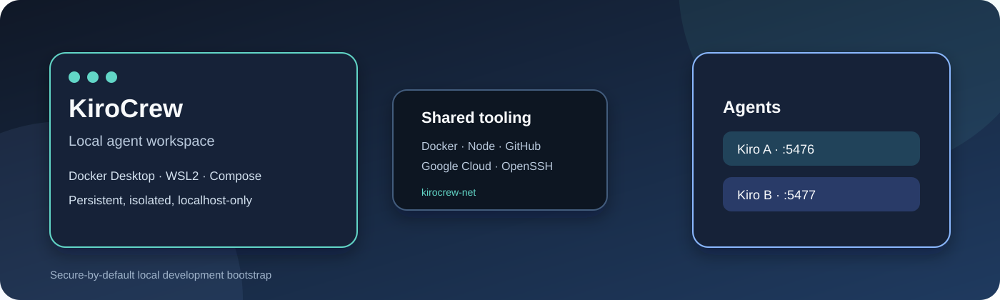

# KiroCrew Docker Compose Bootstrap

[CI workflow](.github/workflows/validate.yml) · [](LICENSE)



Bootstrap local para ejecutar [KiroCrew](https://github.com/kirodotdev/kirocrew) con Docker Desktop y WSL2. El repositorio prepara dos instancias aisladas de Kiro, estado persistente, herramientas Docker/Node/GitHub/Google Cloud, montajes configurables de proyectos y dashboards accesibles únicamente desde localhost.

## Inicio rápido

### Requisitos

- Windows 10/11 con WSL2 habilitado.
- Docker Desktop con el backend WSL2 activo.
- Docker Compose v2.
- Una distribución Linux disponible en WSL2, preferiblemente con el repositorio dentro del sistema de archivos Linux para mejor rendimiento.

Comprueba el entorno desde PowerShell:

```powershell
wsl --status
wsl -l -v --all
docker version
```

Ejecuta los siguientes comandos desde una terminal WSL2 ubicada en este repositorio:

```bash
cp .env.example .env
# Ajusta PROJECTS_BASE si tus repositorios están fuera de ./projects.
make up
make status
```

Si `make` no está instalado en WSL, usa el servicio auxiliar equivalente:

```bash
docker compose --profile tools run --rm make up
docker compose --profile tools run --rm make status
```

`make up` genera primero las máscaras de directorios pesados y después construye/inicia ambas instancias. Los volúmenes persistentes sobreviven a la recreación normal de contenedores.

Si Docker Desktop muestra `Docker Desktop - WSL is unresponsive`, no borres las distribuciones de Docker. Desde PowerShell como administrador puedes reiniciar el servicio y comprobar WSL:

```powershell
Stop-Process -Name "Docker Desktop" -Force -ErrorAction SilentlyContinue
wsl --shutdown
Start-Service WslService
Start-Service com.docker.service
Start-Process "$Env:ProgramFiles\Docker\Docker\Docker Desktop.exe"
wsl -l -v --all
docker info
```

## Instancias y acceso

| Instancia | Dashboard | Puerto del contenedor | Volumen persistente |
| --- | --- | --- | --- |
| Kiro A | http://localhost:5476 | 5476 | `kiro-a-home` |
| Kiro B | http://localhost:5477 | 5476 | `kiro-b-home` |

Ambos dashboards se publican solo en `127.0.0.1`. Los proyectos están disponibles dentro de cada agente en `/home/kirocrew/projects`.

Autentica cada instancia de Kiro cuando sea necesario:

```bash
make kiro-login-a
make kiro-login-b
```

## Operación diaria

| Comando | Propósito |
| --- | --- |
| `make up` | Genera máscaras y arranca ambas instancias. |
| `make up-a` / `make up-b` | Arranca solo una instancia. |
| `make status` | Muestra estado de servicios y healthchecks. |
| `make logs` | Sigue los logs de Kiro A y Kiro B. |
| `make shell-a` / `make shell-b` | Abre una shell dentro de una instancia. |
| `make restart` | Recrea la infraestructura sin eliminar volúmenes. |
| `make configure` | Ejecuta nuevamente la configuración persistente. |
| `make masks` | Regenera las máscaras para montajes Windows lentos. |
| `make backup` | Crea backups de los volúmenes persistentes. |
| `make ssh-test` | Comprueba OpenSSH y `gcloud compute ssh`. |
| `make down` | Detiene y elimina los contenedores de este Compose. |

El servicio opcional `make` permite ejecutar operaciones dentro de Docker sin instalar Make en el host:

```bash
docker compose --profile tools run --rm make status
```

Para montar un proyecto adicional, usa el helper que solo genera el bloque Compose y no modifica archivos automáticamente:

```bash
./scripts/project/add-project.sh demo-app
./scripts/project/add-project.sh demo-app /absolute/path/to/demo-app
```

Consulta la [guía de operaciones en inglés](docs/en/README.md) para montajes, redes compartidas, GCP, GitHub, SSH/IAP, troubleshooting, backups y verificación de contenedores.

## Comunidad y mantenimiento

- [Contributing](CONTRIBUTING.md): flujo de trabajo, validaciones y pull requests.
- [Code of Conduct](CODE_OF_CONDUCT.md): normas de participación y convivencia.
- [Security](SECURITY.md): reporte privado de vulnerabilidades y límites de seguridad.
- [License](LICENSE): licencia MIT.
- [Engineering budgets](docs/operations/budgets.md): presupuestos de CI, runtime, releases y recuperación.

GitHub mostrará estos archivos como documentos de salud de la comunidad al estar en la raíz del repositorio.

## Arquitectura

El stack se divide en tres capas:

1. **Servicios auxiliares** en `compose/shared.yml`: exportan Docker CLI, Node/Playwright y GitHub CLI mediante volúmenes compartidos.
2. **Servicios de configuración** (`kiro-a-config` y `kiro-b-config`): preparan el volumen persistente, identidad Git y configuración de Knowledge antes de iniciar cada agente.
3. **Instancias Kiro** (`kiro-a` y `kiro-b`): ejecutan el runtime local construido desde `docker/Dockerfile.kirocrew`, montan proyectos y exponen sus dashboards en localhost.

El archivo raíz `docker-compose.yml` incluye las definiciones modulares de `compose/`. El `Makefile` concentra las operaciones repetibles y `docker-compose.override.yml` se genera localmente para ocultar directorios de dependencias/cache dentro de los montajes lentos de Windows.

Las decisiones relevantes están documentadas como ADRs:

- [Índice de documentación](docs/README.md)
- [Documentación en inglés](docs/en/README.md)
- [Documentación en español](docs/es/README.md)
- [Guía de seguridad en inglés](docs/en/security.md) · [Guía de seguridad en español](docs/es/security.md)
- [Diagramas de arquitectura](docs/architecture/)
- [ADRs en inglés](docs/en/decisions/)

## Frontera de seguridad

Este proyecto está diseñado para desarrollo local, no para prestar un servicio multiusuario. Los agentes montan el socket de Docker del host, tienen acceso de escritura a los proyectos y usan `SYS_ADMIN`, `seccomp:unconfined` y `apparmor:unconfined` para compatibilidad con sandbox anidado en Docker Desktop/WSL2. No expongas los dashboards a Internet.

Las credenciales de GCP, GitHub y Kiro deben permanecer en `.env` ignorado o en volúmenes persistentes. Nunca deben confirmarse en Git, copiarse a imágenes, documentación o archivos generados. Revisa [ADR-012](docs/en/decisions/ADR-012-gcloud-access-from-acp.md) antes de habilitar acceso ACP a credenciales GCP.

## Estructura del repositorio

```text
.
├── docker-compose.yml             # Punto de entrada Compose
├── compose/                       # Servicios Compose modulares
│   ├── shared.yml
│   ├── kiro-a.yml
│   └── kiro-b.yml
├── docker/                        # Imágenes locales
│   ├── Dockerfile.kirocrew
│   └── Dockerfile.make
├── Makefile                       # Operaciones repetibles
├── scripts/                       # Helpers ejecutables
│   ├── project/add-project.sh
│   └── performance/generate-mask-override.sh
├── tests/validate.sh              # Validación estática del repositorio
├── docs/                          # Operación, seguridad, ADRs, assets y diagramas
│   ├── assets/kirocrew-banner.svg
│   └── operations/budgets.md
├── CODE_OF_CONDUCT.md             # Normas de participación de GitHub
├── CONTRIBUTING.md                # Flujo de contribuciones
├── SECURITY.md                    # Política de seguridad del repositorio
├── LICENSE                        # Licencia MIT
├── projects/.gitkeep              # Punto de montaje local por defecto
├── .env.example                   # Configuración pública de referencia
└── kirocrew-seccomp.json          # Perfil experimental opt-in
```

Archivos locales como `.env`, `docker-compose.override.yml`, `.kiro/` y backups de volúmenes están ignorados y no forman parte del repositorio. El override se regenera con `make masks`; no debe editarse manualmente.

## Validación

Ejecuta estas comprobaciones antes de enviar cambios:

```bash
./tests/validate.sh
docker compose --env-file .env.example config --quiet
docker compose --env-file .env.example --profile tools build make
docker compose --env-file .env.example build kiro-a kiro-b
git diff --check
```

La validación estática no requiere credenciales. La compilación y la verificación de runtime requieren que Docker Desktop/WSL2 esté operativo.

## Licencia

Este proyecto se distribuye bajo la licencia MIT. Consulta [LICENSE](LICENSE).
